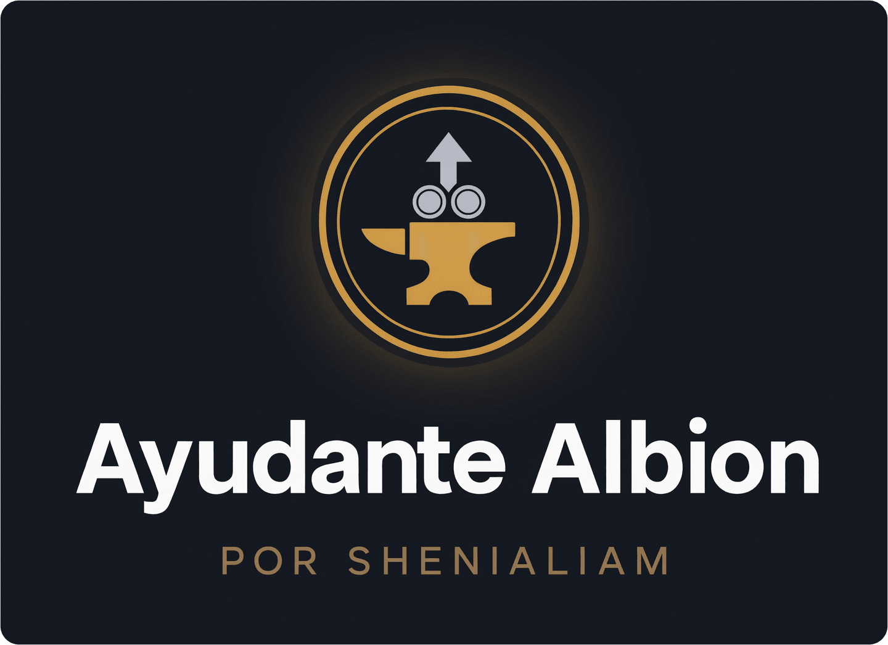

<div align="center">



# Ayudante Albion

Calculadora de mercado y crafteo para **Albion Online** (servidor West), hecha para el gremio **Spetsnaz Grail**.

<a href="https://spetsnazgrail.com" title="Gremio Spetsnaz Grail — sitio web oficial"></a>

<a href="https://discord.gg/FH3RzqMPA4" title="Unite al servidor de Discord de Ayudante Albion"></a>

</div>

Combina las recetas reales del juego con precios de mercado de la comunidad para responder una sola pregunta: **cuánto ganás (o perdés) en cada operación**.

| | |
|---|---|
| 🌐 **Abrir la app** | https://ayudantealbion.github.io |
| 💾 **Descargas y versiones** | [Releases](https://github.com/AyudanteAlbion/AyudanteAlbion.github.io/releases) |
| 💬 **Discord de la app** | https://discord.gg/FH3RzqMPA4 |
| 🛡️ **Gremio Spetsnaz Grail** | [spetsnazgrail.com](https://spetsnazgrail.com) · [Discord](https://discord.gg/TCNWUUA7UY) |

Funciona en el navegador o como ejecutable de escritorio para Windows. No necesita instalación ni cuenta para usar las herramientas de cálculo.

---

## Herramientas

### Crafteo

| Módulo | Qué resuelve |
|---|---|
| **Cocina** | Rentabilidad de comida en Caerleon, con tasa de retorno, Foco y especialización de ciudad |
| **Crafteo de equipo** | Armas y armaduras por ciudad de especialización, con diario de recetas y planeador de producción multiítem |
| **Refinamiento** | Madera, mineral, piedra, piel y fibra, en todos los tiers |
| **Alquimia** | Pociones y tinturas hechas en Brecilien |
| **Encantado** | Comparación entre comprar encantado o encantar con fragmentos, con destino de venta independiente |
| **Granja** | Cultivos y productos animales con bonos de isla por ciudad, Premium, Foco y margen diario por parcela |

### Mercado

| Módulo | Qué resuelve |
|---|---|
| **Flipping** | Compra en 7 ciudades y venta en 8 destinos (incluido el Mercado Negro), con rutas netas de impuestos y filtros por rama y encantamiento |
| **Alertas de precio** | Vigilan un ítem y avisan cuando conviene comprar, vender o flippear |
| **Transmutación** | Costo de subir tier o encantamiento pagando plata, comparado contra comprar el destino |
| **Artefactos** | Valor esperado del melding de fragmentos según la estrategia elegida |
| **Buscador de precios** | Cualquier ítem, todas las calidades, las 7 ciudades y el Mercado Negro, con historial, tendencia y oportunidades |

### Personal

| Módulo | Qué resuelve |
|---|---|
| **Registro de operaciones** | Diario de compras y ventas con P&L, resumen por ítem, exportación CSV, respaldo en archivo y sincronización entre dispositivos |
| **Perfil** | Fama, kills y muertes de tu personaje desde el killboard oficial, y el costo real de Foco según tus especializaciones |
| **Fórmulas** | Referencia de todas las cuentas que usa la app, para poder verificarlas |

### Spetsnaz Grail

La pestaña **SG** es pública e incluye información del gremio, enlaces y creadores con estado EN VIVO / OFFLINE de Twitch.

El **Salón de miembros** se desbloquea ingresando con Discord y suma ranking del gremio, top semanal, vínculo con tu personaje, compositor de builds, **Mapa de Guerra** (territorios, próximos ataques y rivales) y **Tracker por Zona** (actividad PvP por mapa real, con minimapa, nivel de peligro, rutas y alertas).

---

## Cómo trabaja la app

- **Todo precio es editable.** Podés ajustar cualquier valor por ítem, ciudad y calidad, y volver al dato de la API con un botón.
- **Favoritos.** Cualquier receta o ítem se marca con ★ y aparece agrupado en el Inicio.
- **Tus datos son tuyos.** Filtros, rutas, favoritos y registros se guardan en tu navegador. Se exportan como respaldo en archivo, o se sincronizan entre dispositivos si ingresás con Discord.
- **Inicio organizado.** Las herramientas se agrupan en dos vistas, *Crafteo* y *Flipping*, que se recorren con los selectores, las flechas o el teclado.

### Precios

Los precios vienen del último escaneo de la comunidad y pueden tener algunos minutos de demora. El Mercado Negro solo publica órdenes de compra, así que ahí la comparación se hace contra ese bid y no contra un precio de venta.

Las alertas funcionan mientras la app está abierta; si la cerrás, el seguimiento se detiene.

### Mercado Negro

Está disponible como **destino de venta** en Flipping, Crafteo de equipo y el planificador de Encantado, y se puede vigilar desde Alertas. Nunca se ofrece como lugar de compra ni de crafteo: el Mercado Negro compra equipo, no lo vende.

La venta usa el precio que paga el mercado al jugador, con impuesto de 4% u 8% según Premium y sin tasa de publicación.

---

## Sincronización entre dispositivos

Los miembros de Spetsnaz Grail que ingresan con Discord pueden guardar una copia de sus datos en la nube y recuperarla en otra PC, otro navegador o después de reinstalar el ejecutable. Está en el *Registro de operaciones*, en el bloque **☁️ Sincronizar entre dispositivos**.

| Botón | Qué hace |
|---|---|
| **Subir a la nube** | Guarda los datos de este dispositivo y reemplaza la copia anterior |
| **Bajar de la nube** | Trae la copia guardada y sobreescribe los datos de este dispositivo |
| **Borrar copia** | Elimina lo guardado en el servidor; los datos locales no se tocan |

**Nada es automático.** Cada acción pide confirmación y muestra la fecha de la copia remota antes de sobreescribir nada.

Se sincronizan registro, favoritos, precios manuales, alertas, planes de crafteo, preferencias y perfil. La sesión de Discord nunca se sincroniza.

---

## Acceso de miembros SG

La app es pública, pero el **Salón de miembros** está reservado a Spetsnaz Grail.

1. Entrá a **SG → Salón de miembros** (o tocá el botón de Discord de la barra superior) y elegí **«Ingresar con Discord»**.
2. Discord te pide autorizar el acceso a tu identidad y a la lista de tus servidores. Nada más: no se piden mensajes, ni amigos, ni permisos de bot.
3. Volvés a la app con la sesión activa. Si estás en el Discord de SG, el Salón se desbloquea; si no, aparece la invitación y un botón para volver a verificar cuando te unas.

La sesión dura 7 días y se revalida en cada carga. «Cerrar sesión» está en el menú de tu avatar. Si cancelás en Discord, la app avisa y no pasa nada más.

La app nunca confía en una sesión hasta que el servidor confirma su firma y su vigencia; una sesión alterada se descarta.

---

## Ejecutable

`AyudanteAlbion.exe` para Windows 10/11 x64. Al abrirlo levanta un servidor local en el puerto 3000 (usa otro si está ocupado) y funciona igual que la versión web, incluido el ingreso con Discord.

---

## Publicación de versiones

Las versiones de Windows se publican creando un tag semántico en `main`, por
ejemplo:

```bash
git tag v1.2.8
git push origin v1.2.8
```

El workflow **Build release assets** valida el repositorio y compila el `.exe`,
el `.zip` y sus checksums como artefactos temporales. Cuando termina con éxito,
**Publish release** descarga esos artefactos, verifica sus SHA-256 y recién
entonces crea o actualiza la release de GitHub. La compilación y la publicación
usan workflows y permisos separados.

En Discord, el canal de Actualizaciones recibe el changelog de la versión en
curso cuando `CHANGELOG.md` cambia en `main`, y una alerta cuando se publica
cada release. Los mensajes van como texto organizado, sin emojis: solo el
título lleva su ícono (🗒️ changelog, 💚 release).

Las descripciones de cambios que ya están en `main` se corrigen mediante PRs de
documentación sobre `CHANGELOG.md`, `docs/releases/` o el cuerpo del PR. No se
reescribe el historial de `main` ni se fuerza un push para cambiar mensajes de
commit antiguos.

---

## Comunidad y soporte

- **Discord de la app** — https://discord.gg/FH3RzqMPA4 · novedades, avisos de versiones, reportes y pedidos de funciones. También está en el Inicio, en «Únete a nuestra comunidad».
- **Discord del gremio** — https://discord.gg/TCNWUUA7UY · para jugar con Spetsnaz Grail. Es además el que verifica el acceso al Salón de miembros.
- **Reportar un problema** — el botón al final del Inicio abre un issue con una plantilla en español ya cargada. Lo revisás y lo enviás desde tu cuenta de GitHub; la app no reporta nada por su cuenta ni adjunta datos de tu navegador, tu almacenamiento local ni tu sesión.

---

## Desarrollo y validación

La validación local no requiere instalar dependencias adicionales:

```bash
python3 scripts/validate_repo.py
```

Comprueba sintaxis de JavaScript y Python, JSON, `wrangler.toml`, referencias
HTML y entradas necesarias para el build. GitHub Actions la ejecuta en cada
pull request que afecte al código o a la infraestructura.

---

## Documentación

| Documento | Contenido |
|---|---|
| [`docs/sincronizacion.md`](docs/sincronizacion.md) | Contrato, límites y control de acceso de la copia en la nube |
| [`docs/farming.md`](docs/farming.md) | Bonos de isla, fuentes de datos y alcance del cálculo de Granja |
| [`docs/tracker-mapas-reales.md`](docs/tracker-mapas-reales.md) | Diseño del Tracker por Zona y sus fuentes de datos |
| [`docs/frontend-modules.md`](docs/frontend-modules.md) | Arquitectura del frontend y reglas de contribución |
| [`docs/COMMIT_CONVENTION.md`](docs/COMMIT_CONVENTION.md) | Regla de mensajes de commit basados en nombres de archivo |
| [`SECURITY.md`](SECURITY.md) | Política de seguridad y reporte de vulnerabilidades |
| [`CHANGELOG.md`](CHANGELOG.md) | Historial de cambios de todas las versiones |
| [`docs/releases/`](docs/releases/) | Notas publicadas de cada versión |

---

## Licencia y créditos

Código bajo licencia MIT (ver [`LICENSE`](LICENSE)). La licencia cubre únicamente el código propio: los íconos, nombres y datos del juego pertenecen a Sandbox Interactive, y las tablas extraídas de `ao-bin-dumps` siguen las condiciones de ese proyecto comunitario.

Desarrollado por **SheniaLiam** para el gremio **Spetsnaz Grail**. Los íconos y datos provienen de proyectos comunitarios; el killboard es de Sandbox Interactive.
