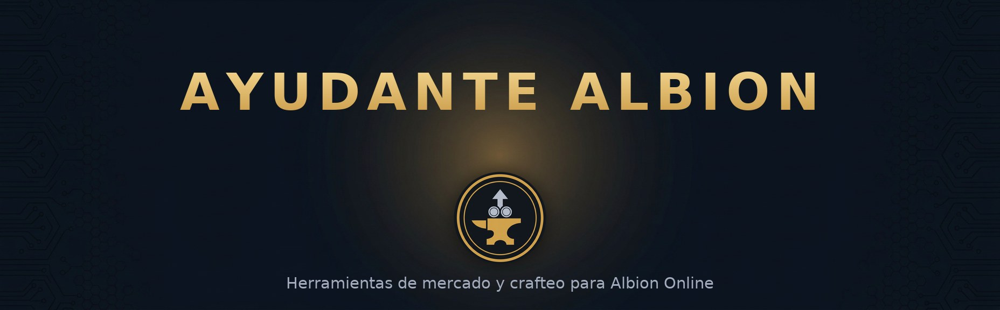

# Ayudante Albion



Calculadora de mercado y crafteo para Albion Online (servidor West), hecha para el gremio Spetsnaz Grail.

Combina las recetas reales del juego con precios de mercado de la comunidad para responder una sola pregunta: cuánto ganás (o perdés) en cada operación. Accede a la página web o descarga el ejecutable de escritorio.

- Accede a la App: https://ayudantealbion.github.io
- Descarga y notas de versión: https://github.com/AyudanteAlbion/AyudanteAlbion.github.io
- Web del gremio: https://spetsnazgrail.com
- Discord: https://discord.gg/cqG7rDmUSJ

## Módulos

| Módulo | Qué hace |
|---|---|
| Cocina | Rentabilidad de crafteo de comida en Caerleon con RRR, foco y especialización de ciudad |
| Crafteo de equipo | Armas y armaduras por ciudad de especialización, con el diario de recetas disponible |
| Refinamiento | Madera, mineral, piedra, piel y fibra, tiers completos |
| Alquimia | Pociones y tinturas hechas en Brecilien |
| Encantado | Comprar el ítem encantado vs. encantar con fragmentos, con las cantidades oficiales |
| Granja | Cultivos, animales y productores; ganancia diaria por parcela |
| Flipping | Mejor ruta de compra/venta entre las 7 ciudades, neto de impuestos; origen y destino fijables y se recuerdan |
| Alertas de precio | Vigilan un ítem mientras la app está abierta y avisan cuando conviene comprar, vender o flippear |
| Transmutación | Costo de subir tier o encantamiento pagando plata, comparado contra comprar el destino |
| Artefactos | Valor esperado del melding de fragmentos según la estrategia elegida |
| Buscador de precios | Cualquier ítem, todas las calidades, las 7 ciudades más el Mercado Negro, con historial |
| Registro de operaciones | Diario personal de compras y ventas con P&L, resumen por ítem y exportación CSV |
| Perfil | Fama, kills y muertes del personaje real desde el killboard oficial, más el cálculo del costo de Foco según tus especializaciones |
| Gremio | Enlaces de Spetsnaz Grail y creadores del gremio con estado EN VIVO / OFFLINE de su canal de Twitch |
| Acceso SG | Ingreso con cuenta de Discord; los miembros verificados del servidor desbloquean la Sala: ranking completo del gremio, stats, top semanal y vínculo con tu personaje |
| Fórmulas | Referencia de todas las cuentas que usa la app, para poder verificarlas |

Comportamientos comunes a las herramientas de cálculo:

- Todo precio es editable a mano por ítem, ciudad y calidad, con un botón para volver al valor de la API.
- Cada receta o ítem se puede marcar como favorito y aparece agrupado en la pantalla de inicio.
- Filtros, rutas, favoritos y registros se guardan en `localStorage` del navegador; desde el Registro de operaciones se exportan o importan como un único JSON de respaldo.

## Acceso de miembros SG (Discord)

La app es pública, pero tiene una sección exclusiva: los miembros de Spetsnaz Grail ingresan con su cuenta de Discord y desbloquean la **Sala de miembros** (ranking completo del gremio desde el killboard, estadísticas, top semanal y vínculo con su personaje de Albion).

Cómo funciona: el botón «Ingresar con Discord» pasa por el Worker de Cloudflare, que hace el intercambio OAuth2 (el secreto nunca llega al navegador), verifica si el usuario pertenece al servidor de Discord de SG y devuelve una sesión firmada válida 30 días. El «Ver miembros del gremio» del módulo Perfil también queda reservado a miembros.

### Puesta en marcha (una sola vez)

1. **Crear la app de Discord**: en el [Developer Portal](https://discord.com/developers/applications) → New Application. Copiar el **Client ID** y el **Client Secret** (pestaña OAuth2). No hace falta bot.
2. **Registrar el redirect**: en OAuth2 → Redirects, agregar exactamente:
   `https://ayudantealbion.josemesina21.workers.dev/discord/callback`
3. **Obtener el ID del servidor SG**: en Discord, Ajustes → Avanzado → Modo desarrollador activado; clic derecho sobre el servidor de Spetsnaz Grail → «Copiar ID del servidor».
4. **Configurar el Worker**: en el dashboard de Cloudflare → Workers & Pages → `ayudanteAlbion` → Settings → Variables and Secrets:
   - `DISCORD_CLIENT_ID` (texto) — el Client ID
   - `SG_DISCORD_GUILD_ID` (texto) — el ID del servidor
   - `DISCORD_CLIENT_SECRET` (**secreto**) — el Client Secret
   - `AA_SESSION_KEY` (secreto, opcional) — clave para firmar sesiones; si no se define, se usa el Client Secret
5. **Deployar**: el Worker se construye solo desde este repo al pushear a `main`.

Hasta que las variables existan, la app funciona normal y el botón de Discord permanece oculto (`GET /discord/config` responde `configured: false`).

### Probar sin tocar Discord

```bash
node worker/selftest.mjs     # 32 chequeos del OAuth con Discord simulado
cd albion-app && node qa-test.js   # QA completa, incluye la Sala de miembros
```

## Ejecutable

`AyudanteAlbion.exe` para Windows 10/11 x64. Al abrirlo levanta un servidor local en el puerto 3000 (usa otro si está ocupado)

Para trabajar localmente:

```bash
cd albion-app
python3 server.py     # http://localhost:3000
```

El server local incluye un simulador del consentimiento de Discord (`/discord/login`): permite probar el ingreso de miembros SG, la Sala y el caso no-miembro sin necesidad de configurar Cloudflare.

## Precios

Los precios reflejan el último escaneo de la comunidad, que puede tener varios minutos de demora. El Mercado Negro solo publica órdenes de compra (te compra a vos); por eso ahí la comparación se hace contra ese bid y no contra un precio de venta. Las alertas de precio solo funcionan con la app abierta. Si la cierras se detiene el seguimiento.

## Licencia

El código de este repositorio está bajo licencia MIT (ver `LICENSE`). La licencia cubre únicamente el código propio: los íconos, nombres y datos del juego pertenecen a Sandbox Interactive y las tablas extraídas de `ao-bin-dumps` siguen las condiciones de ese proyecto comunitario.

## Créditos

Desarrollado por SheniaLiam para el gremio Spetsnaz Grail. Los íconos y datos provienen de proyectos comunitarios; el killboard es de Sandbox Interactive.
