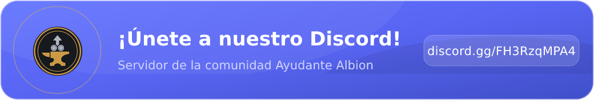

<div align="center">


# Ayudante Albion

Calculadora de mercado y crafteo para **Albion Online** (servidor West), hecha para el gremio  **Spetsnaz Grail**

<a href="https://discord.gg/FH3RzqMPA4" title="Unite al servidor de Discord de Ayudante Albion"></a>

</div>

Combina las recetas reales del juego con precios de mercado de la comunidad para responder una sola pregunta: cuánto ganás (o perdés) en cada operación. Accede a la página web o descarga el ejecutable de escritorio.

- Accede a la App: https://ayudantealbion.github.io
- Descarga y notas de versión: https://github.com/AyudanteAlbion/AyudanteAlbion.github.io
- Web del gremio: https://spetsnazgrail.com
- Discord del gremio (Spetsnaz Grail): https://discord.gg/TCNWUUA7UY
- Discord de la app (Ayudante Albion): https://discord.gg/FH3RzqMPA4

## Módulos

| Módulo | Qué hace |
|---|---|
| Cocina | Rentabilidad de crafteo de comida en Caerleon con RRR, foco y especialización de ciudad |
| Crafteo de equipo | Armas y armaduras por ciudad de especialización, con el diario de recetas disponible |
| Refinamiento | Madera, mineral, piedra, piel y fibra, tiers completos |
| Alquimia | Pociones y tinturas hechas en Brecilien |
| Encantado | Comprar vs. encantar con fragmentos; planificador con destino de venta independiente, incluido Black Market |
| Granja | Cultivos y productos animales con bonos de isla por ciudad; mercado independiente, Premium, Foco y margen diario por parcela |
| Flipping | Compra en 7 ciudades y venta en 8 destinos (incluido Black Market), con rutas netas de impuestos, filtros de rama y encantamiento sobre los ítems monitoreados, y preferencias guardadas |
| Alertas de precio | Vigilan un ítem mientras la app está abierta y avisan cuando conviene comprar, vender o flippear |
| Transmutación | Costo de subir tier o encantamiento pagando plata, comparado contra comprar el destino |
| Artefactos | Valor esperado del melding de fragmentos según la estrategia elegida |
| Buscador de precios | Cualquier ítem, todas las calidades, las 7 ciudades más el Mercado Negro, con historial |
| Registro de operaciones | Diario personal de compras y ventas con P&L, resumen por ítem y exportación CSV |
| Perfil | Fama, kills y muertes del personaje real desde el killboard oficial, más el cálculo del costo de Foco según tus especializaciones |
| SG → Spetsnaz Grail | Información del gremio, enlaces a su web y Discord, y creadores con estado EN VIVO / OFFLINE de Twitch |
| SG → Salón de miembros | Ingreso con Discord; los miembros verificados desbloquean ranking, top semanal, vínculo de personaje, exportación CSV, compositor de builds, **Mapa de Guerra** (territorios reconstruidos desde GvG del killboard, próximos ataques y rivales) y **Tracker por Zona** (actividad PvP por mapa real: minimapa del mundo, peligro por zona, rutas seguras, alertas de zona y detalle de batallas). Son botones separados en el Salón |
| Fórmulas | Referencia de todas las cuentas que usa la app, para poder verificarlas |

El **Inicio** organiza las herramientas en dos slides manuales: **Crafteo** (equipo, refinamiento, alquimia, cocina, encantado y granja) y **Flipping** (flipping, transmutación, artefactos y alertas). Se cambian con los selectores de grupo, las flechas o el teclado, sin avance automático. Buscador, Registro, Perfil y Fórmulas conservan accesos rápidos; los favoritos siguen aparte.

Comportamientos comunes a las herramientas de cálculo:

- Todo precio es editable a mano por ítem, ciudad y calidad, con un botón para volver al valor de la API.
- Cada receta o ítem se puede marcar como favorito y aparece agrupado en la pantalla de inicio.
- Filtros, rutas, favoritos y registros se guardan en `localStorage` del navegador; desde el Registro de operaciones se exportan o importan como un único JSON de respaldo.

## Bonos de Granja / Islas

La **ciudad de la isla** aplica el bono local de +10% nominal al producto correspondiente; la **ciudad de precios** se elige por separado. Las dos ciudades se recuerdan. Las filas bonificadas y su desglose indican el bono aplicado.

El modelo distingue cultivos/hierbas, crías y productores de huevos/leche. No añade bonos a animales vivos ni monturas. Se corrigieron también las fórmulas relacionadas de cosecha, Premium, devolución de semillas y cuidados. Los resultados son estimaciones: no simulan el redondeo de cada cosecha; los márgenes de animales son antes de alimento y la carnicería no está incluida.

Ver [distribución por ciudad, fuentes y fórmulas](docs/farming.md). Pruebas: `cd albion-app && node farm-test.js` (requiere `jsdom`).

## Reportar errores

Al final de **Inicio**, el botón **Reportar un problema** abre un nuevo issue de este repositorio en otra pestaña. Incluye una plantilla en español con herramienta afectada, descripción, pasos para reproducir, resultado esperado, entorno y capturas opcionales.

El usuario revisa y envía el reporte desde su cuenta de GitHub; los issues son públicos. La app no crea reportes automáticamente ni adjunta datos del navegador, almacenamiento local o sesión de Discord. La plantilla también está disponible en `.github/ISSUE_TEMPLATE/bug_report.md` para quienes reporten directamente desde el repositorio. El enlace de la app lleva el contenido precargado, por lo que no depende de la publicación de esa plantilla.

## Comunidad

El botón de arriba lleva al **servidor de Discord de Ayudante Albion** (https://discord.gg/FH3RzqMPA4): ahí se comparten novedades, avisos de versiones, bugs y pedidos de funciones de la app. Dentro de la app el mismo destino está en el **Inicio**, en la pastilla «Únete a nuestra comunidad», justo debajo del crédito del gremio.

Es un servidor separado del del gremio — para jugar con Spetsnaz Grail hay que pasar por su Discord (https://discord.gg/TCNWUUA7UY), que además es el que verifica el acceso al Salón de miembros.

## Black Market: solo destino de venta

- Disponible en Flipping, Crafteo de equipo y el planificador de Encantado. En Alertas se puede vigilar su orden de compra o incluirlo en la mejor ruta de flipping.
- Nunca se ofrece como origen de compra ni como lugar de crafteo en el Registro. No se añade a los módulos de recursos, consumibles, artefactos ni granja: el Black Market compra equipo.
- La venta usa `buy_price_max` (lo que paga el mercado al jugador), con impuesto de 4%/8% según Premium, sin tasa de publicación. Sin orden de compra, no se calcula una venta con `sell_price_min` como respaldo.
- Flipping, Crafteo y Encantado consultan calidad Normal para evitar comparar precios de calidades distintas. El Buscador mantiene todas las calidades, sin mostrar compras en Black Market.

Pruebas de regresión (requieren `jsdom`):

```bash
cd albion-app
node black-market-test.js
node qa-test.js
node smoke-test.js
```

## Acceso de miembros SG (Discord)

> **Estado: activo.** El ingreso con Discord funciona en producción (web y ejecutable) desde el 9 de septiembre de 2026. `GET https://ayudantealbion.josemesina21.workers.dev/discord/config` responde `{"configured":true, …, "missing":[]}`.

La app es pública, pero tiene una sección exclusiva: los miembros de Spetsnaz Grail ingresan con su cuenta de Discord y desbloquean el **Salón de miembros** (ranking completo del gremio desde el killboard, estadísticas, top semanal, vínculo con su personaje de Albion y el **Mapa de Guerra**).

El killboard oficial **no** publica un listado de dueños de territorios (`/guilds/:id/territories` no existe). El Mapa de Guerra reconstruye la posesión a partir del historial y la cola de GvG (`guildmatches/past` y `guildmatches/next`): el último ganador de cada territorio es su dueño actual, y los ataques declarados marcan amenazas. También muestra rivales recientes y kills del gremio.

El Salón muestra cuatro botones: **Resumen**, **Builds**, **Mapa de Guerra** y **Tracker por Zona**. Las dos herramientas de guerra están separadas a propósito —cada una muestra solo lo suyo— y se cruzan apenas con atajos: cada territorio tiene su botón 🎯 Rastrear (elige esa zona y saltea al tracker), y el tracker muestra a cuántos saltos queda el territorio propio y el rival más cercano.

El **tracker por zona real** es la herramienta aparte: elegís cualquier mapa del juego (grafo oficial `world.xml`, 851 zonas con sus conexiones) y la herramienta busca sus conexiones, analiza los últimos asesinatos en el mapa y en los mapas conectados, y rankea qué zonas están más activas según la cantidad de kills. Los datos se cruzan entre **tres fuentes**: el killboard oficial paginado (≈300 batallas del servidor), los **asesinatos crudos** del feed `/events` (≈250 kills recientes, incluyendo los kills en solitario que nunca entran a `/battles`) y **Murderledger/AlbionOnline2D** como testigo de frescura (si su base está más al día que el feed oficial, la app avisa que el API del juego viene atrasada); cada kill además enlaza a KillBoard#1, AlbionOnline2D y el killboard oficial para verificarlo a mano. Incluye un **panel de fuentes** con el estado y la antigüedad del último dato de cada proveedor, un **ranking de actividad por zona** ordenado por asesinatos, un **minimapa del mundo** con las posiciones oficiales del cliente (seleccionado en verde, vecinos en amarillo, batallas como puntos rojos y territorios SG marcados), **scoring de peligro** por zona (batallas `kills + fama/1000` + kills crudos, con decaimiento de 2 h: 🟢 tranquilo / 🟡 activo / 🔴 muy caliente), **rutas seguras** (la más corta por BFS y la que esquiva zonas calientes, con el conteo de batallas de las últimas 2 h en cada salto), **alertas por zona** (como las de precio: toast + beep + notificación cuando aparece una batalla en una zona vigilada), **detalle de batalla** con participantes, IP y gremio, filtros por tipo de mapa (Zona Negra T7/T8, Caminos de Avalon, etc.), exportación **CSV** (batallas y asesinatos) y links para compartir (`?map=NombreDeZona`). Las consultas se cachean 5 minutos para no quemar el rate limit del killboard.

La pestaña **SG** tiene dos subpestañas: **Spetsnaz Grail**, pública y seleccionada por defecto, y **Salón de miembros**, con el acceso y las herramientas. El retorno desde Discord y el acceso desde el menú de cuenta abren directamente el Salón. Las subpestañas también se recorren con las flechas del teclado, Inicio y Fin.

### Cómo ingresar (usuarios)

1. Pestaña **SG → Salón de miembros** (o el botón de Discord de la barra superior) → **«Ingresar con Discord»**.
2. Discord pide autorizar a *Ayudante Albion* para ver tu identidad y la lista de tus servidores. Solo eso: no se piden mensajes, ni amigos, ni permisos de bot.
3. Volvés a la app con la sesión activa. Si estás en el servidor de Discord de SG, el Salón se desbloquea; si no, aparece la invitación al servidor y el botón «Volver a verificar» para reintentar después de unirte.
4. La sesión dura 30 días y se revalida con el servidor en cada carga. «Cerrar sesión» está en el menú del avatar.

Si tocás «Cancelar» en Discord, la app simplemente avisa y no pasa nada más.

### Cómo funciona (técnico)

El botón «Ingresar con Discord» lleva a `/discord/login` del Worker de Cloudflare, que redirige a la pantalla de autorización de Discord con `scope=identify guilds` y un `state` firmado (HMAC, 10 minutos). Discord vuelve a `/discord/callback`, donde el Worker canjea el código con el Client Secret (que nunca llega al navegador), consulta `GET /users/@me` y `GET /users/@me/guilds`, y comprueba si entre los servidores figura el de Spetsnaz Grail. Devuelve a la app una sesión firmada válida 30 días por el fragmento de la URL (`#aa_session=…`, que no viaja a ningún servidor).

**La app no confía en ninguna sesión** (ni la que vuelve de Discord ni la guardada en el navegador) hasta que `GET /discord/verify` del Worker confirma firma y vigencia; una sesión forjada o alterada se descarta. El «Ver miembros del gremio» del módulo Perfil también queda reservado a miembros. Los datos que hoy muestra el Salón siguen siendo públicos (killboard); cualquier futura herramienta con datos privados debe servirlos desde el Worker validando la sesión, nunca desde el sitio estático.

Rutas del Worker: `GET /discord/config` (`{configured, loginUrl, missing[]}`), `GET /discord/login?redirect=`, `GET /discord/callback`, `GET /discord/verify?s=`. Códigos de vuelta a la app: `#aa_error=config` (Worker sin variables), `discord` (código rechazado o redirect URI mal registrado), `gremio` (Discord no respondió la lista de servidores) y `cancelado` (el usuario canceló).

### Configuración del Worker (mantenimiento)

Todo vive en Cloudflare → Workers & Pages → `ayudantealbion` → Settings → **Variables and Secrets**. Ya está cargado; esto es la referencia para reponerlo si hace falta:

| Variable | Tipo | Valor |
|---|---|---|
| `DISCORD_CLIENT_ID` | Secret | Client ID de la app en el [Developer Portal](https://discord.com/developers/applications) (OAuth2 → Client information) |
| `DISCORD_CLIENT_SECRET` | Secret | Client Secret de la misma pantalla (si se perdió: *Reset Secret*) |
| `AA_SESSION_KEY` | Secret | Clave HMAC de sesiones: `openssl rand -hex 32` (≥32 caracteres, distinta del Client Secret) |
| `SG_DISCORD_GUILD_ID` | `[vars]` en `wrangler.toml` | `998772435048472628` (ID del servidor de Spetsnaz Grail; es público) |

En el Developer Portal, OAuth2 → Redirects debe tener exactamente `https://ayudantealbion.josemesina21.workers.dev/discord/callback`. No hace falta bot.

**Por qué todo va como Secret:** Workers Builds despliega con `wrangler deploy` en cada push a `main`, y ese comando borra las variables de tipo *Text* del dashboard que no estén declaradas en `wrangler.toml`. Así fue como el acceso quedó inactivo un tiempo: `DISCORD_CLIENT_ID` estaba como Text y desapareció con un merge. Los Secrets nunca se borran, y además `wrangler.toml` lleva `keep_vars = true` como segunda red. Al cambiar `AA_SESSION_KEY`, las sesiones vigentes dejan de validar y la gente vuelve a ingresar con un clic; no hay nada más que avisar.

Si alguna variable falta, la app no se rompe: el Salón muestra las herramientas, un aviso de configuración pendiente y el botón «Comprobar de nuevo»; el botón de Discord de la barra se oculta. `GET /discord/config` nombra lo que falta en `missing` (nunca valores) y la app lo deja en la consola del navegador. Apenas el Worker vuelve a estar configurado, la app lo detecta sola al volver a la pestaña, sin recargar. La guía paso a paso y el checklist de verificación están en [`docs/deploy-worker.md`](docs/deploy-worker.md).

### Probar sin tocar Discord

```bash
node worker/selftest.mjs           # OAuth, verificación de sesión y allowlist del proxy (incl. Mapa de Guerra), Discord simulado
cd albion-app && python3 server.py # server local con simulador de consentimiento de Discord (miembro / no miembro)
cd albion-app && node qa-test.js   # QA completa, incluye la Sala y el Mapa de Guerra
```

## Ejecutable

`AyudanteAlbion.exe` para Windows 10/11 x64. Al abrirlo levanta un servidor local en el puerto 3000 (usa otro si está ocupado)

Para trabajar localmente:

```bash
cd albion-app
python3 server.py     # http://localhost:3000
```

El server local incluye un simulador del consentimiento de Discord (`/discord/login`): permite probar el ingreso de miembros SG, la Sala y el caso no-miembro sin necesidad de configurar Cloudflare.

## Seguridad

- **CSP** en `index.html`: solo se ejecuta `app.js` (sin scripts inline ni de terceros) y la red queda acotada a las APIs que usa la app. Si se agrega un servicio nuevo hay que sumarlo a la política o el navegador lo bloquea. Por eso los botones se enganchan con `data-*` y delegación de eventos, nunca con `onclick` inline.
- Todo dato que llega de fuera (Discord, killboard) se escapa antes de pintarse; los toasts usan texto plano.
- La sesión de Discord solo se acepta después de que el Worker confirme su firma (`/discord/verify`).
- El proxy del Worker reenvía únicamente las rutas del killboard que usa la app y solo a los orígenes de la app (GitHub Pages y localhost).
- Los CSV neutralizan celdas que empiezan como fórmula; el respaldo solo exporta/importa claves de datos conocidas (nunca la sesión ni la configuración del proxy).
- `server.py` escucha solo en `127.0.0.1`.

## Precios

Los precios reflejan el último escaneo de la comunidad, que puede tener varios minutos de demora. El Mercado Negro solo publica órdenes de compra (te compra a vos); por eso ahí la comparación se hace contra ese bid y no contra un precio de venta. Las alertas de precio solo funcionan con la app abierta. Si la cierras se detiene el seguimiento.

## Licencia

El código de este repositorio está bajo licencia MIT (ver `LICENSE`). La licencia cubre únicamente el código propio: los íconos, nombres y datos del juego pertenecen a Sandbox Interactive y las tablas extraídas de `ao-bin-dumps` siguen las condiciones de ese proyecto comunitario.

## Créditos

Desarrollado por SheniaLiam para el gremio Spetsnaz Grail. Los íconos y datos provienen de proyectos comunitarios; el killboard es de Sandbox Interactive.
